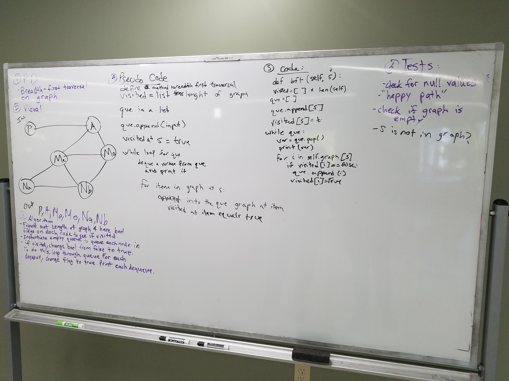

# Breadth-first
Write a function that traverses over a graph breadth-first

## Challenge
The traversal goes breadth first, which goes by levels. And prints each node on that level starting from the left before moving to the next level. This traversal utilizes a queue.
The graph does not have a root node but will intake the graph itself. Each node in the graph will be taken into the queue by being appended and enqueued. For each node dequeued, it will be printed and return until completion.

## Solution

