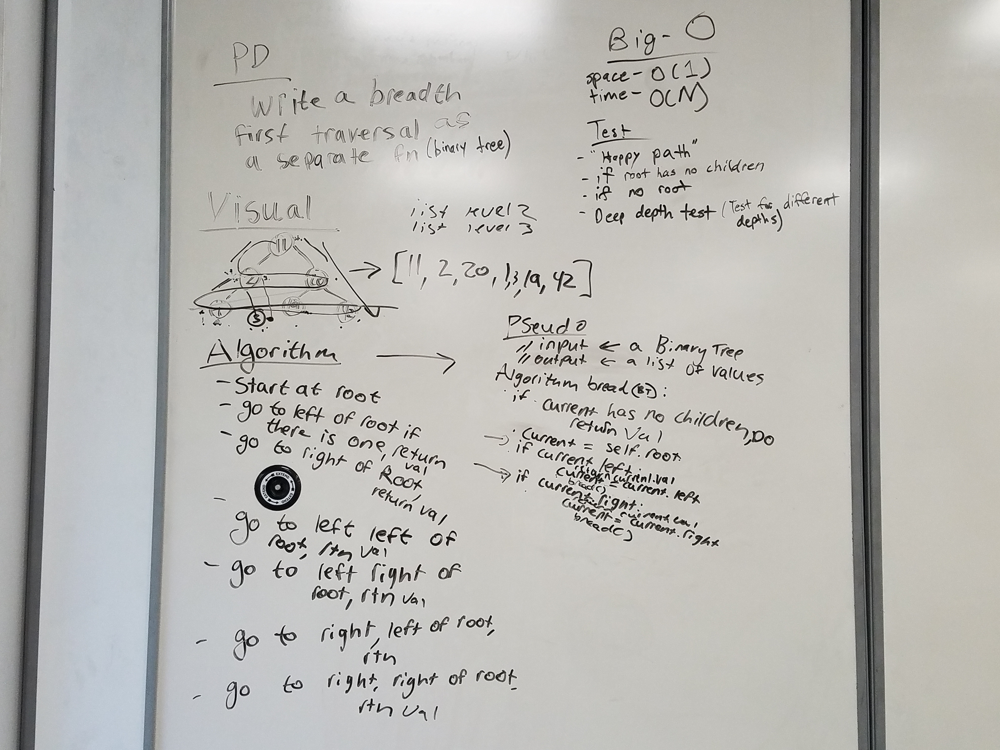

# Breadth-first
Write a function that takes a binary tree and does a breadth-first traversal over it.

## Challenge
The traversal goes breadth first, which goes by levels. And prints each node on that level starting from the left before moving to the next level. This traversal utilizes a queue rather than recursive.
The traversal will first check for a root node. If none, then return. If not none, then continue to see if a left and/or right child exist. If so, start with the left child first and print then return to the right child from the root node and print as well. Reassign the root node to the next node on the far left till right. In a snake-squiggle like action. Continue until all nodes accounted for.

## Solution

