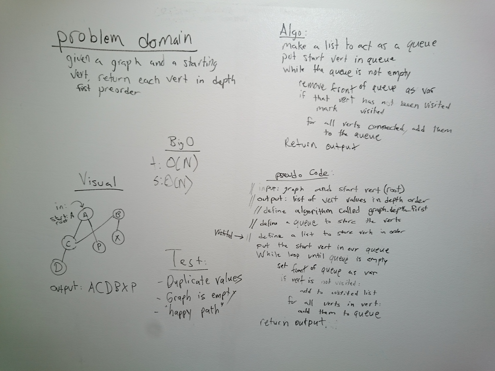

# Get Edges
"Conduct a depth first preorder traversal on a acyclic graph"

## Challenge
The challenge is to have a root node. And print every node iterated through in depth-first preorder. The tricky part is having to continuously move through the graph starting to the left. First print the root node. Then print all nodes to the left of the root. If no more nodes exist to the left, then move to the right. If not more to the right, continue onto the next node on the same level as the root until the same occurs -- none left. Each node will have a boolean flag set to the default of false. The bool variable will be called 'visited.' If visited, the bool will be reassigned to True so it is not hit again.

## Solution

