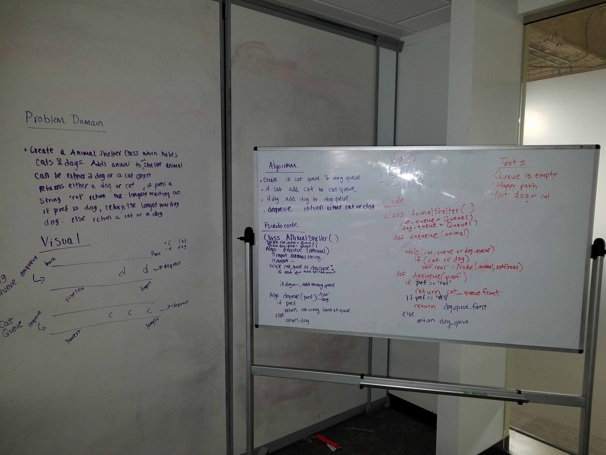

# First-in, First out Animal Shelter.
"First in, first out animal shelter"

## Challenge
The challenge is to create a first in, first out animal shelter. First, instantiate two queues - one called cat queue and the other dog queue. We will have the cats and dogs separated into each queue. With enqueue, the dogs and cats will be put into their appropriate queues. For dequeue, the cats or dogs at the top will be returned.

## Solution

## Acknowledgements
Worked with Liz Mahoney
