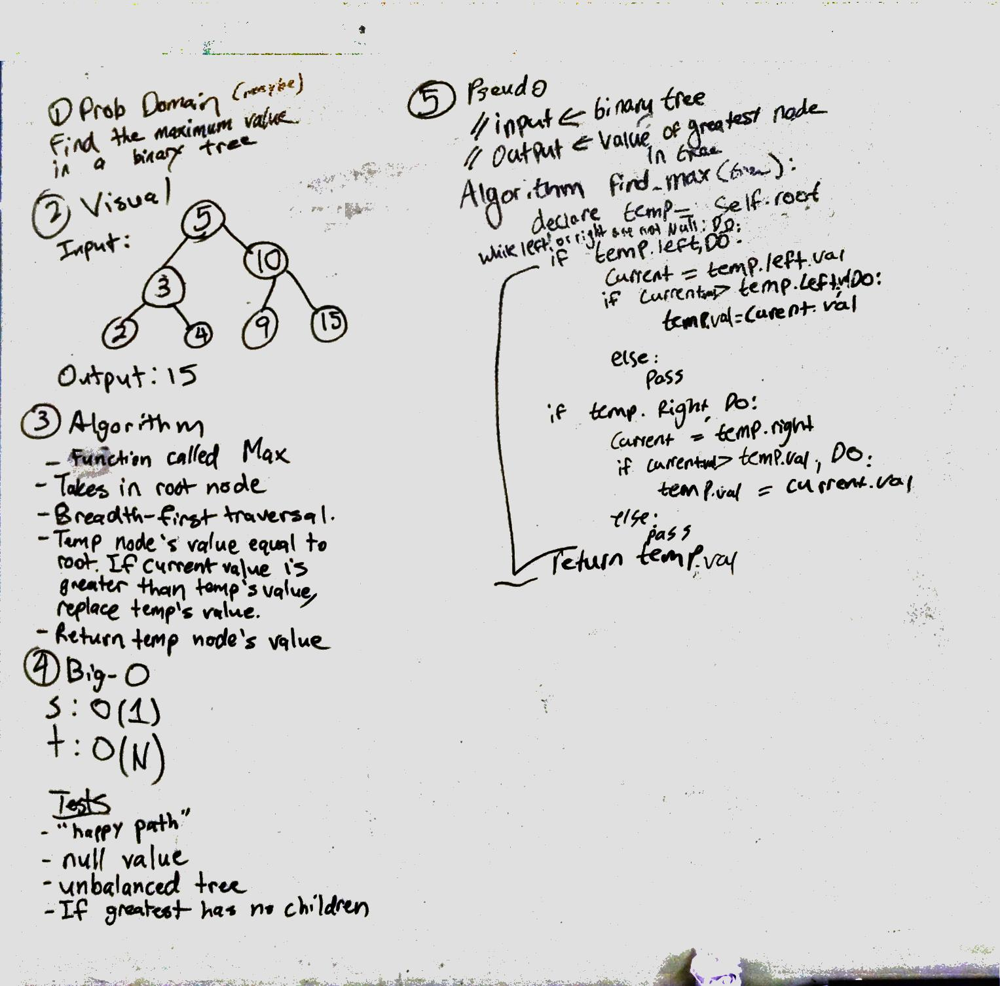

# Find the Maximum Value in a Binary Tree
The challenge is to find the maximum value in a binary tree.

## Challenge
First instantiate a tree with a queue as well as an empty temp node. The plan is to perform a breadth-first traversal. The empty temp node will hold the initial value of the root. And comparing each node through the traversal with the temp node, seeing if it is greater than the temp node's value. If it is, replace that value and continue through the traversal until every node is touched. And return the temp node's value.

## Solution

