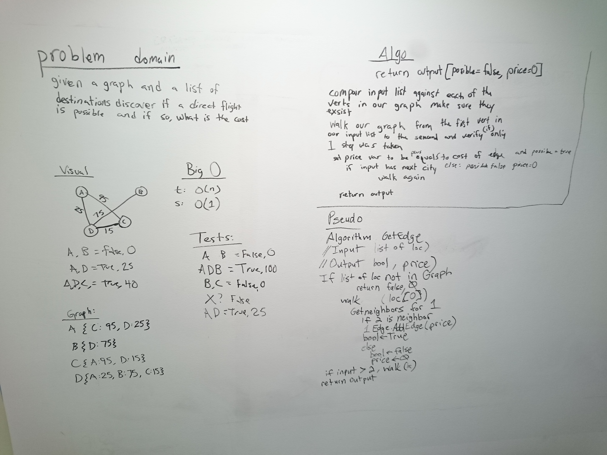

# Get Edges
"Given a business trip itinerary, and an Alaska Airlines route map, is the trip possible with direct flights? If so, how much will the total trip cost be?"

## Challenge
The challenge is to have two locations and determine if it is a direct flight or not. Then if more locations are given, to check if those also have direct flights from the last given point. And continue to completion.
After complete, add the weight to a list and return.
It is important to note if direct flights between the two locations is not possible, then return a false and a weight of zero. All or nothing.

## Solution

