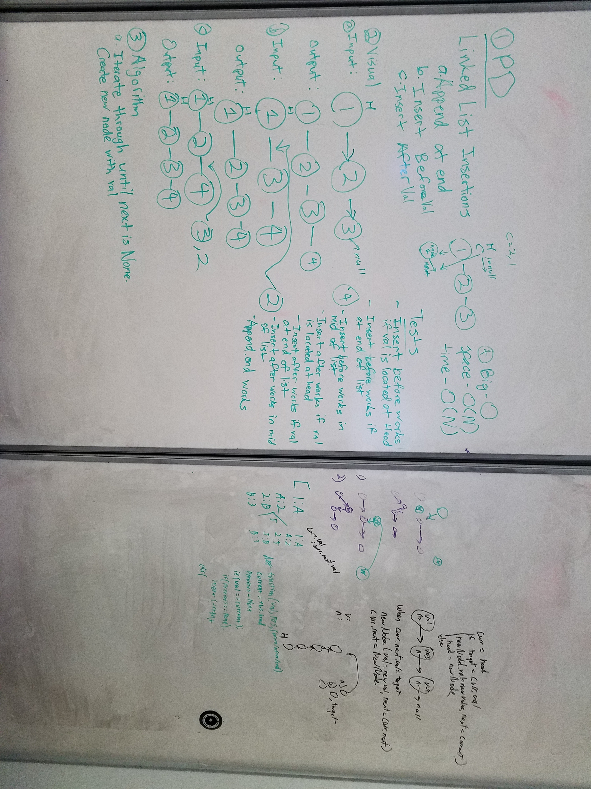

# Linked List Insertions
"Linked list insertions."

## Challenge
Write the following methods for the Linked List class:
- .append(value) which adds a new node with the given value to the end of the list
- .insertBefore(value, newVal) which add a new node with the given newValue immediately before the first value node
- .insertAfter(value, newVal) which add a new node with the given newValue immediately after the first value node

## Solution

**Authors**: Chris L Chapman, Steph Harper, Madeline Peters, and Nick Damberg
