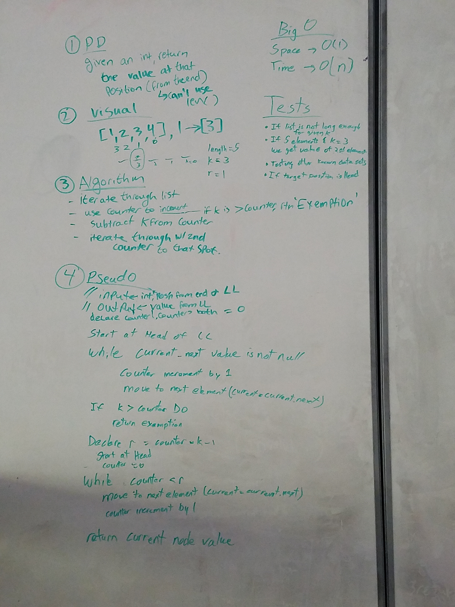

# kth from the end of a Linked List
Find the k-th value from the end of a linked list. ​​

## Challenge
The challenge is to find the given value of k from the end of a given linked list. The way we did it is through first instantiating a linked list. Then to have an empty counter. We have the counter so we can iterate through the list and find the length. If we have the length, we know how long the list is and can figure out the k by subtracting k from length. Ex: 5(length) - 3(k) = Position 2.
​
## Solution
​

## Acknowledgements
Worked with Madeline Peters, Nick Damberg, Christopher Chapman, and me, Stephen Harper
