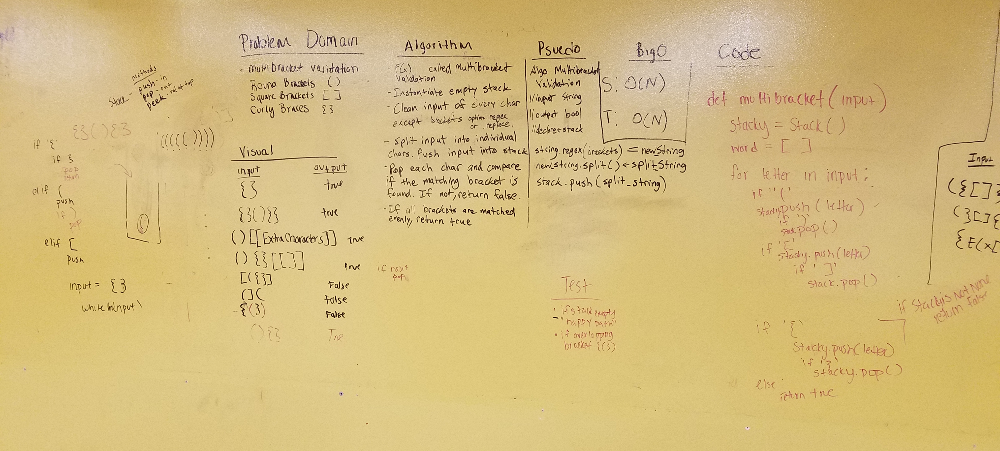

# Multi-bracket Validation.
'Your function should take a string as its only argument, and should return a boolean representing whether or not the brackets in the string are balanced. There are 3 types of brackets:

Round Brackets : ()
Square Brackets : []
Curly Brackets : {}'

## Challenge
The challenge here is to determine if the given string is accepted or not. The most difficult was understanding how to deal with the edge case of (})}. But Elizabeth and I were able to figure it out by using a stack -- we would clean the input first of any other chars besides the brackets. The way we chose is with regex. After, split the input into singular chars. Then push each char in one at a time. If the char that is currently in the stack has a matching char, pop out current and move on to the next char. If it doesn't, keep pushing until it finds a connecting char. If no connecting char is found and the stack has anything in it, return false. But if no chars are found in the stack because they each found a connection, then return true.

Example: '('. If next is ')', pop this. If it is anything else, keep pushing until a connection is found. I'm reminded of tetris -- when the blocks form a line, it will disappear. If not, then the stack of blocks will become higher and higher. The same can be said here.

## Solution

