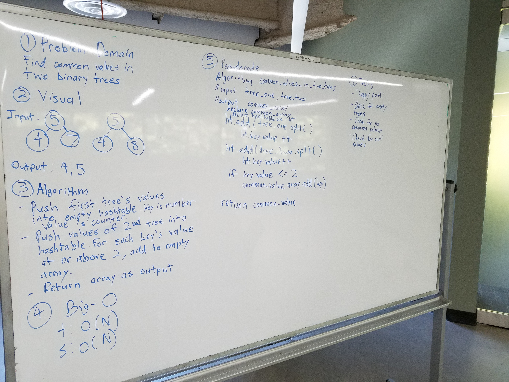

# Tree intersection
Find common values in 2 binary trees.

## Challenge
The challenge is to return what common values are present in two separate binary trees. The method I go with is pushing all of the values of each binary tree into a hashtable. The key is the number while the key's value is a counter. For each key's value that is equal to or above 2, push to an empty array. Return the empty array with the common values.

## Solution
​
